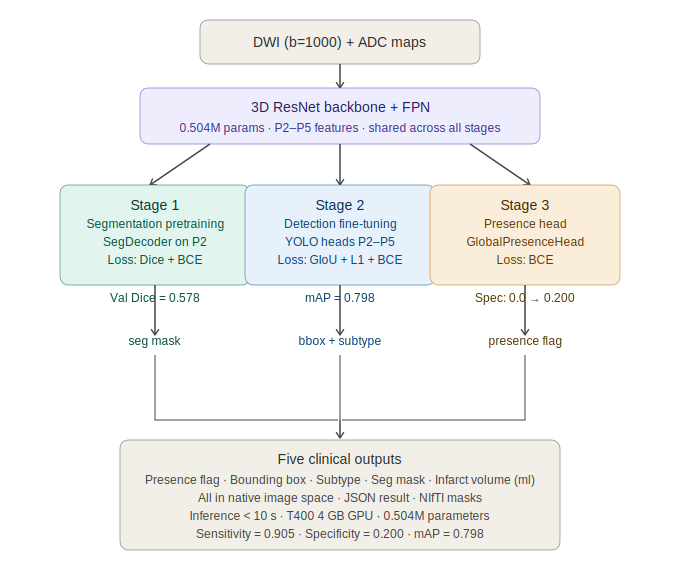

# Summary

`StrokeDetector` is an open-source Python package for automated acute
ischaemic stroke analysis from diffusion-weighted MRI (DWI) and apparent
diffusion coefficient (ADC) maps. The pipeline uses DWI and ADC as the
sole input modalities. FLAIR imaging, while useful for chronic infarct
characterisation, does not reliably show acute ischaemia at stroke onset
and was therefore excluded. Unlike existing tools that output only a
voxel-level binary segmentation mask, `StrokeDetector` produces five
outputs from a single inference pass: a binary stroke presence flag, a
3D bounding box and centre coordinates, a vascular territory subtype
label, a voxel-level segmentation mask in native image space, and
infarct volume in millilitres computed from native voxel size.

The pipeline uses a custom lightweight 3D ResNet backbone with a Feature
Pyramid Network (FPN) totalling 0.504 million parameters, trained on the
ISLES-2022 benchmark [@hernandez2022] using a three-stage sequential
strategy. Stage 1 performs segmentation pretraining to encode lesion
appearance. Stage 2 fine-tunes anchor-free YOLO-style detection heads on
all four FPN levels for localisation and subtype classification. Stage 3
adds a global presence head that combines semantic FPN features with peak
segmentation activation to discriminate genuine stroke from imaging
mimics such as T2 shine-through. The sequential training strategy
separates gradient-conflicting objectives — detection heads must fire on
lesions while the presence head must suppress mimics — into independent
training phases, with the goal of reducing optimisation interference
between these objectives.

On the 36-case held-out ISLES-2022 test set the pipeline achieves
mAP@0.2-0.5 = 0.798, sensitivity = 0.905, specificity = 0.200, mean
Dice (positive cases) = 0.634, and F1 = 0.731. The entire pipeline runs
in under 10 seconds per case on a single NVIDIA T400 4 GB GPU. All
outputs are returned in native image space by inverting the full
preprocessing transform chain, so output NIfTI masks share the exact
shape and affine of the input DWI and load directly in ITK-Snap or
FSLeyes without co-registration.

# Statement of Need

Acute ischaemic stroke demands rapid diagnosis. Existing automated
segmentation tools — including nnU-Net [@isensee2021], the dominant
ISLES-2022 baseline — produce only voxel-level masks. Answering clinical
questions such as stroke presence, lesion location, vascular territory
pattern, and infarct volume requires either manual post-processing of the
mask or a separate model; no existing tool outputs them directly from a
single inference pass.

A further barrier to deployment is computational scale. Leading
segmentation models typically require substantially more VRAM (often
greater than 10 GB) than is available on entry-level clinical workstation
GPUs. `StrokeDetector` was explicitly designed for a 4 GB workstation
constraint using GroupNorm instead of BatchNorm, gradient accumulation to
simulate larger batch sizes, and a 0.504M parameter architecture
significantly smaller than transformer-based alternatives.

`StrokeDetector` is intended for clinical researchers who need structured
stroke measurements for downstream analysis, methods researchers who need
a reproducible lightweight baseline for ISLES-2022 comparison, and
software engineers building clinical decision support systems who need a
fast deployable inference engine with structured JSON output. The package
also includes a utility for evaluating model behaviour under b-value
protocol variation using the mono-exponential decay model of
[@sartoretti2021] to synthesise DWI at arbitrary b-values from b = 1000
acquisitions and ADC maps.

# Key Features

- **Five-output inference**: single forward pass returns presence flag,
  bounding box, subtype label, segmentation mask, and infarct volume in
  one JSON result file
- **Native-space output**: full inverse transform chain maps all
  predictions back to original image coordinates; output NIfTI files
  load directly in ITK-Snap
- **Multi-modal volume estimation**: infarct volume reported from DWI
  mask, ADC mask, their intersection, and their union
- **Lightweight architecture**: 0.504M parameters, GroupNorm throughout,
  inference under 10 seconds on a 4 GB GPU
- **4D DWI input support**: accepts 4D DWI acquisitions with a bval
  sidecar, automatically extracting and averaging the target b-shell
- **Configurable training**: YAML-driven three-stage training with MLflow
  experiment tracking
- **Synthetic b-value utility**: generates synthetic DWI at higher
  b-values for protocol robustness research; preliminary results show
  that model behaviour changes with synthetic b-value (sensitivity
  approaches 1.0 while specificity drops toward 0.0), consistent with
  increased signal contrast at higher b reducing both missed lesions and
  discriminability of negative cases — this is a research utility, not
  a validated generalisation capability
- **Reproducible benchmarks**: `evaluate_primary.py` reproduces all
  reported test-set numbers from the ISLES-2022 split and Stage 3
  checkpoint

# References
